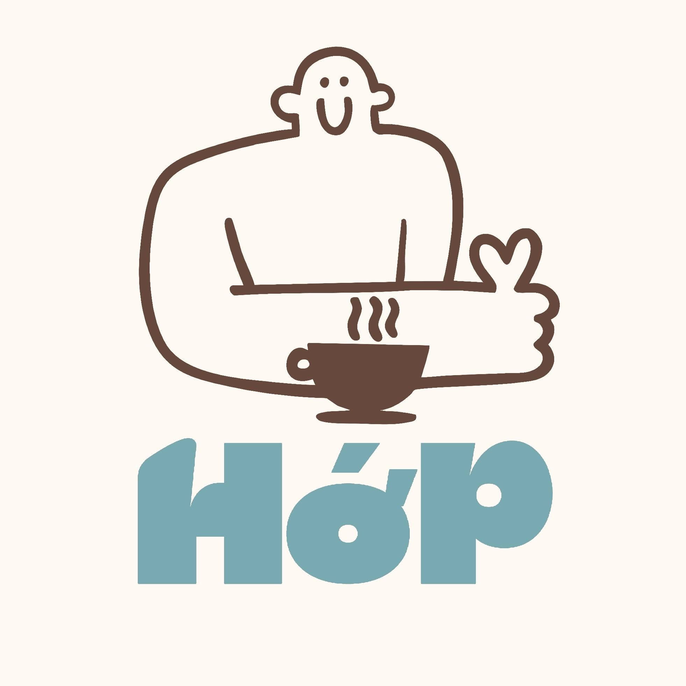

<div align="center">



# ☕ F&B Coffee Menu

### Website menu online cho quán cafe & F&B

Khách quét QR hoặc bấm link là xem menu ngay — admin quản lý toàn bộ, không cần đụng code.

<p>
  
  
  
  
  
</p>

<p>
  <strong>🔗 Demo trực tiếp:</strong> <a href="https://www.hop-coffee.website/hop-caffe">hop-coffee.website/hop-caffe</a> — quán <strong>Hớp Cafe</strong>
</p>

[Tổng quan](#-tổng-quan) • [Tính năng](#-tính-năng-chính) • [Tech Stack](#️-kiến-trúc--tech-stack) • [Cài đặt](#-quick-start) • [Deploy](#-deploy) • [Roadmap](#-roadmap)

</div>

<br />

## ✨ Tổng quan

**F&B Coffee Menu** là ứng dụng web fullstack giúp chủ quán cafe / nhà hàng tạo menu online chuyên nghiệp chỉ trong vài phút. Khách hàng truy cập menu qua QR Code hoặc link trực tiếp, còn admin điều khiển toàn bộ nội dung — món ăn, danh mục, khuyến mãi, bài viết — thông qua một dashboard trực quan, không cần viết một dòng code nào.

Dự án đang chạy thực tế cho quán **Hớp Cafe** tại domain riêng `hop-coffee.website`, với mỗi quán được định danh bằng một `shopSlug` riêng trên cùng hệ thống:

<table>
<tr>
<td width="50%" valign="top">

**🧑‍🤝‍🧑 Trang khách**
```
https://www.hop-coffee.website/hop-caffe
https://www.hop-coffee.website/hop-caffe/blog
```

</td>
<td width="50%" valign="top">

**🔐 Trang quản trị**
```
https://www.hop-coffee.website/admin/login
https://www.hop-coffee.website/admin/dashboard
```

</td>
</tr>
</table>

> 💡 Hệ thống hỗ trợ nhiều quán trên cùng một domain — chỉ cần đổi `shopSlug` (ví dụ `hop-caffe`) là ra một menu độc lập khác.

<br />

## 🚀 Tính năng chính

<table>
<tr>
<th width="50%">👤 Phía khách hàng</th>
<th width="50%">🛠️ Phía Admin</th>
</tr>
<tr valign="top">
<td>

- Xem danh mục, tìm kiếm & lọc món theo category
- Trạng thái còn bán / tạm hết hiển thị realtime
- Khu vực món nổi bật (Best Seller)
- Banner khuyến mãi kèm popup chi tiết (ảnh + video)
- Trang blog / bài viết riêng cho quán
- Gọi quán, chỉ đường Google Maps, chat Zalo chỉ 1 chạm
- Giao diện mobile-first, tối ưu UX trên điện thoại

</td>
<td>

- Đăng nhập bảo mật qua Firebase Auth
- Quản lý danh mục: tạo, sửa, ẩn/hiện, xóa
- CRUD món đầy đủ + upload ảnh lên Firebase Storage hoặc dán URL
- **Kéo thả** (dnd-kit) sắp xếp thứ tự hiển thị
- Bật/tắt trạng thái món, đánh dấu món nổi bật
- Quản lý khuyến mãi: nhiều ảnh/video, thêm bằng URL, kéo thả sắp xếp, đặt ngày bắt đầu/kết thúc
- Quản lý bài viết (blog): soạn nội dung, media, ghim bài, ẩn/hiện
- Cài đặt quán: logo, ảnh bìa, SĐT, Zalo, Google Maps, slug, bật/tắt menu public

</td>
</tr>
</table>

<br />

## 🏗️ Kiến trúc & Tech Stack

```
src/
├── app/router.jsx              # Định tuyến với React Router v7
├── pages/
│   ├── admin/                  # Dashboard, Menu, Promotions, Posts, Settings, Login
│   └── public/                 # MenuPage, BlogPage (trang khách)
├── components/
│   ├── admin/menu/              # Panel quản lý danh mục, món, thống kê...
│   └── public/menu/             # Hero, ProductGrid, PromotionModal, Blog...
├── services/                    # Firestore CRUD: shop, category, item, promotion, post
├── hooks/                       # useAuth, useShopMenu, useMenuItemsAdmin
├── layouts/                     # AdminLayout (protected), PublicLayout
└── lib/firebase.js              # Khởi tạo Firebase
```

| Layer | Công nghệ |
|---|---|
| UI Framework | React 19 + Vite 8 |
| Routing | React Router v7 |
| Styling | Tailwind CSS v4 |
| Database | Cloud Firestore |
| Auth | Firebase Authentication |
| File Storage | Firebase Storage |
| Drag & Drop | `@dnd-kit/core` + `@dnd-kit/sortable` |
| Icons | Lucide React |
| Deploy | Vercel |

<br />

## 🗺️ Routes

| Route | Mô tả |
|---|---|
| `/admin/login` | Đăng nhập admin |
| `/admin/dashboard` | Tổng quan thống kê |
| `/admin/menu` | Quản lý danh mục & món |
| `/admin/promotions` | Quản lý khuyến mãi |
| `/admin/posts` | Quản lý bài viết / blog |
| `/admin/settings` | Cài đặt thông tin quán |
| `/:shopSlug` | Trang menu công khai của quán |
| `/:shopSlug/blog` | Trang blog công khai của quán |

<br />

## 🗄️ Data Model (Firestore)

```
shops/{shopId}
  ├── categories/{categoryId}   # name, order, isActive
  ├── items/{itemId}            # name, price, oldPrice, imageUrl, isAvailable, isFeatured, order, tags
  ├── promotions/{promotionId}  # title, media[], startAt, endAt, isActive, order
  └── posts/{postId}            # title, content, media[], coverUrl, isPublished, isPinned, order
```

> Mỗi `promotion` và `post` hỗ trợ mảng `media[]` gồm nhiều ảnh/video kèm đầy đủ metadata (`url`, `type`, `name`, `mimeType`, `size`).

<br />

## ⚡ Quick Start

**1. Clone & cài đặt**

```bash
git clone https://github.com/khoale-dev-code/F-and-B-Coffe.git
cd F-and-B-Coffe
npm install
```

**2. Khai báo biến môi trường**

Tạo file `.env.local` ở thư mục gốc:

```env
VITE_FIREBASE_API_KEY=...
VITE_FIREBASE_AUTH_DOMAIN=...
VITE_FIREBASE_PROJECT_ID=...
VITE_FIREBASE_STORAGE_BUCKET=...
VITE_FIREBASE_MESSAGING_SENDER_ID=...
VITE_FIREBASE_APP_ID=...
VITE_FIREBASE_MEASUREMENT_ID=...
VITE_DEFAULT_SHOP_ID=demo-shop
```

**3. Chạy dự án**

```bash
npm run dev      # Môi trường phát triển
npm run build    # Build production
npm run preview  # Xem trước bản build
npm run lint     # Kiểm tra code style
```

<br />

## 🔐 Firebase Security Rules

| Service | Read | Write |
|---|---|---|
| **Firestore** | Public khi shop có `isPublished = true` | Yêu cầu đăng nhập |
| **Storage** | Public (ảnh/video hiển thị tự do) | Yêu cầu đăng nhập |

<br />

## 📦 Deploy

Dự án được deploy trên **Vercel**. File `vercel.json` cấu hình rewrite toàn bộ route về `index.html` để React Router hoạt động đúng khi người dùng refresh trang ở các route con (SPA fallback).

<br />

## 📌 Roadmap

- [ ] Multi-shop support với phân quyền theo từng shop
- [ ] Dashboard thống kê lượt xem menu
- [ ] Tạo QR Code trực tiếp trong admin
- [ ] Tùy chỉnh theme màu theo thương hiệu
- [ ] Hỗ trợ size / topping cho từng món
- [ ] Đặt món online

<br />

---

<div align="center">
  <sub>Đang phục vụ thực tế cho quán <a href="https://www.hop-coffee.website/hop-caffe">Hớp Cafe</a> ☕</sub>
  <br />
  <sub>Built with ❤️ by <a href="https://github.com/khoale-dev-code">khoale-dev-code</a></sub>
</div>